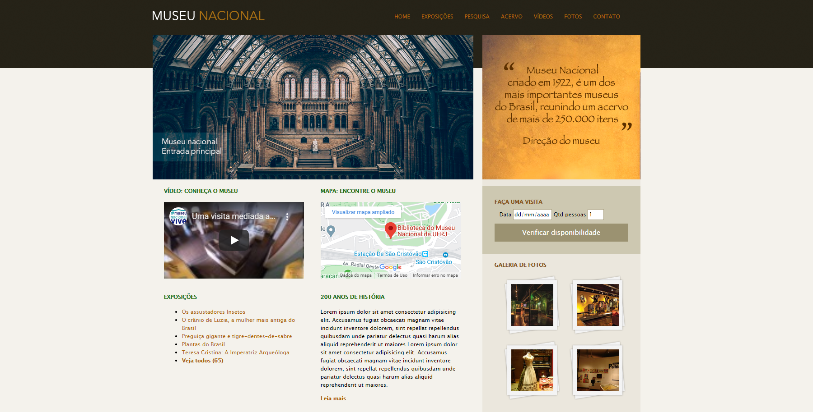

<h1>Projeto Museu Nacional</h1>

O projeto <strong>Museu Nacional</strong> foi desenvolvido durante o curso "Desenvolvimento Web Completo 2020" ministrado por  Jorge Sant Ana e Jamilton Damasceno por meio da plataforma de ensino <a href ="https://www.udemy.com/">Udemy.<a>

Este projeto teve como objetivo criar um Front-end utilizando HTML e CSS para uma página web do Museu Nacional

## Tecnologias utilizadas:

  - [HTML](https://www.w3schools.com/html/default.asp)
  - [CSS](https://www.w3schools.com/css/)

## Front-end

